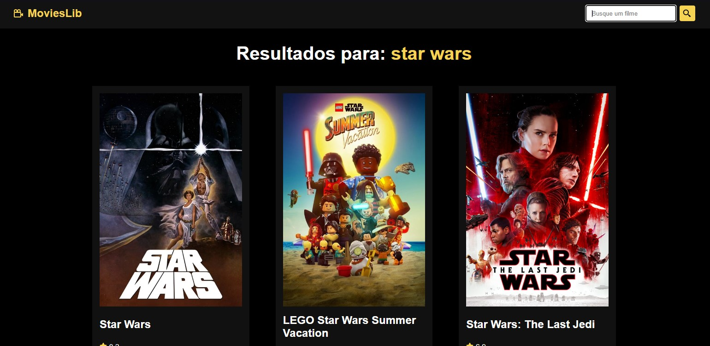
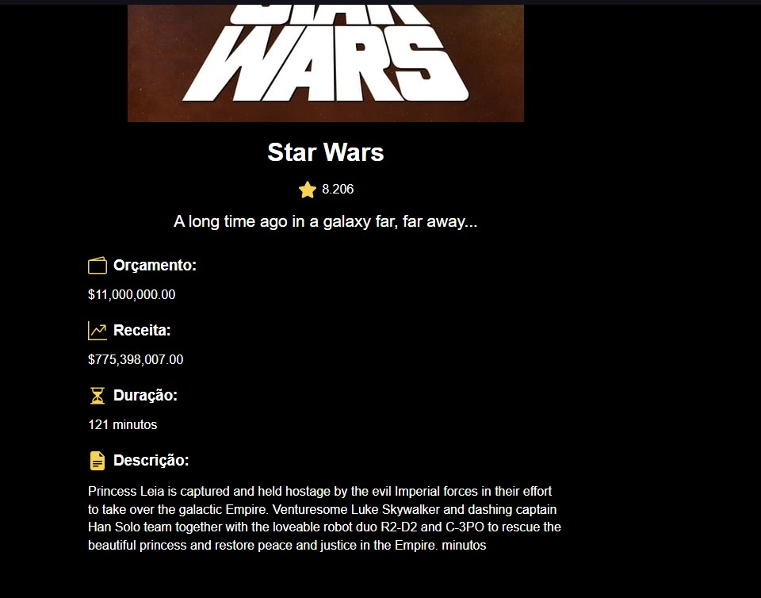
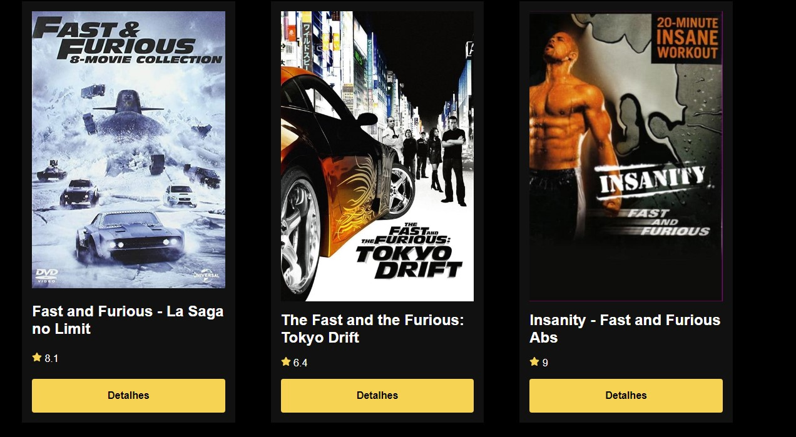

# Movies_lib

  
  
  

>Projeto 'Filmes'
Projeto <b><i><u>'Clima Agora'</b></i></u> Projeto com React, consumindo a API do TMDB (filmes), utilizando hooks e React Router, criado com Vite  
Projeto construído seguindo as dicas do <b>Matheus Battisti - Hora de Codar</b> [YouTube](https://youtu.be/XqxUHVVO7-U)

## 🌐 Tecnologias

 

 

 

## 📱 Contato

